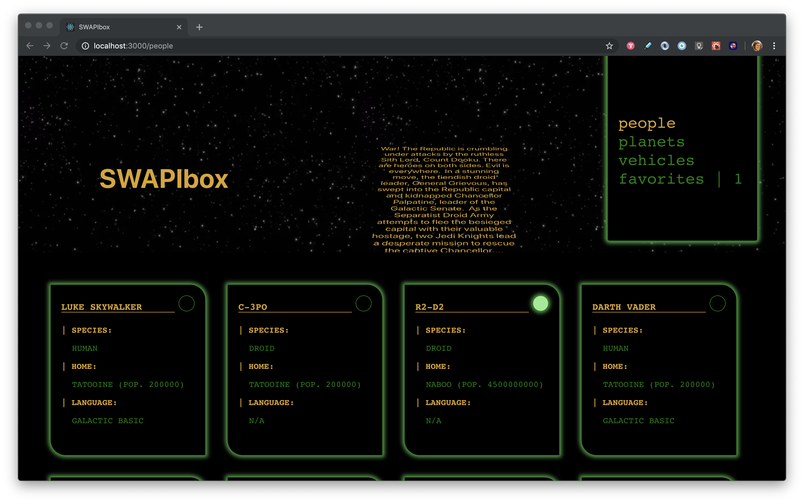
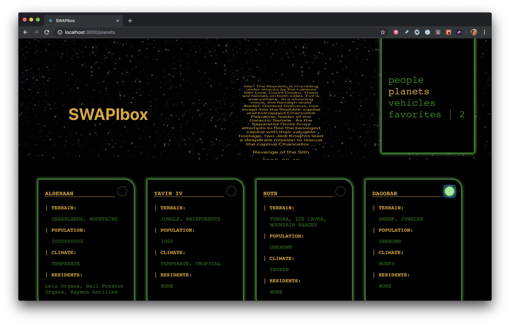
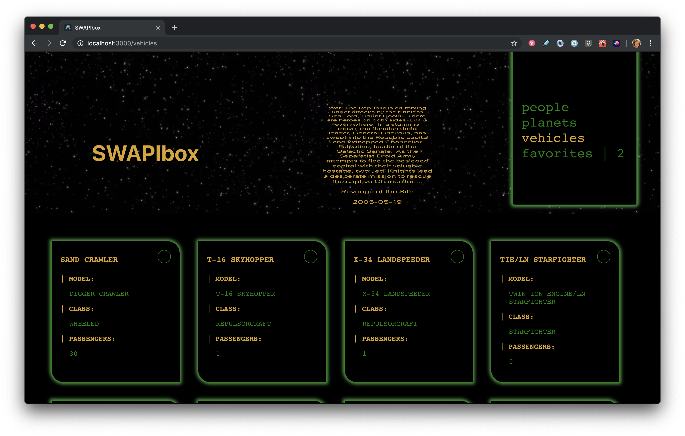
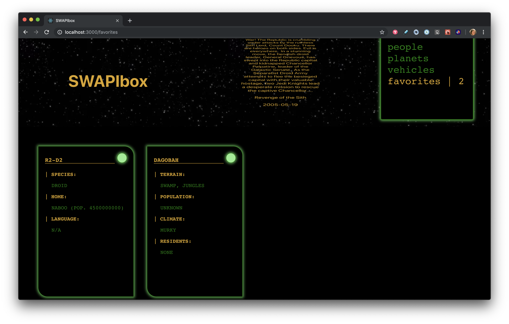
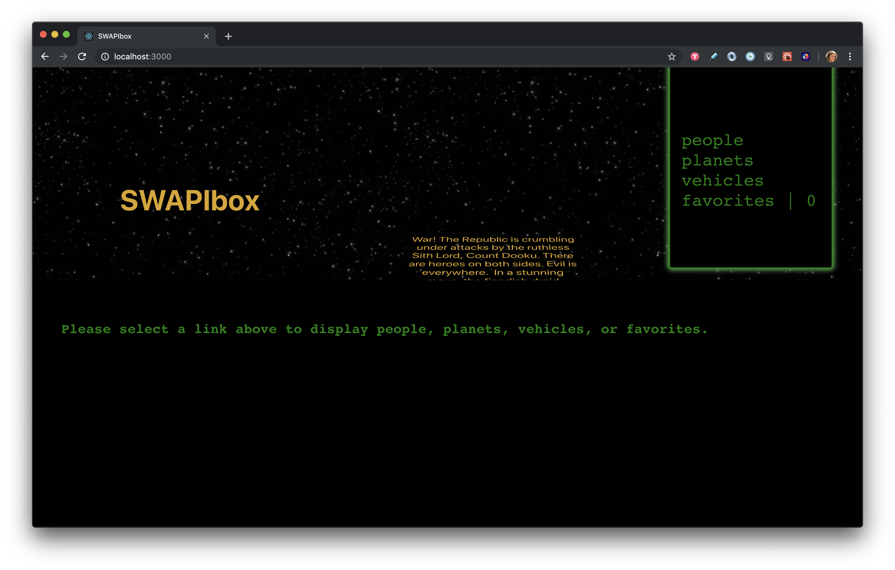

# SWAPI-box

This is the second project in Front End Module 3 at Turing School of Software & Design. The app was built using React (`create-react-app`), and uses Enzyme/Jest for testing, and React Router, and uses asynchronous JavaScript to query the Star Wars API. 

Users are able to view a random text-crawl of a random Star Wars movie upon page load, and can select different routes to view vehicles, people, and planets. Users may add any cards to the favorites list and select the '/favorites' route to view them. 

## Objectives 

Write clean code that is purposeful in using extended Component classes versus functional components. 
Create an easy-to-use UI. 
Use the fetch API to access data, using Promises, and cleaning the data to serve the needs of the app. 
Use React Router to create an app with multiple pages.
Use Jest/Enzyme to test the app, including testing of some fetch calls and Route testing. 
Use propTypes to verify proper props are passed between functions. 

## The Result

### '/people' Route

### '/planets' Route

### '/vehicles' Route

### '/favorites' Route

### '/' Route

# Setup

`git clone` this repository
`npm i` to install dependencies
`npm start` to run a local server 
`npm test` to see testing suite

